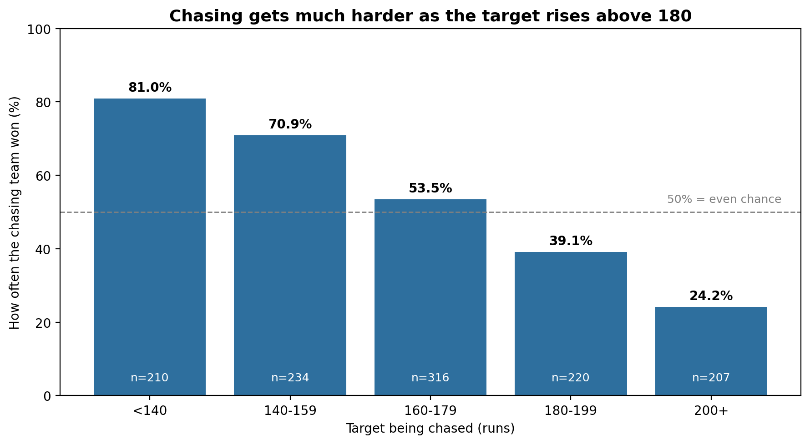
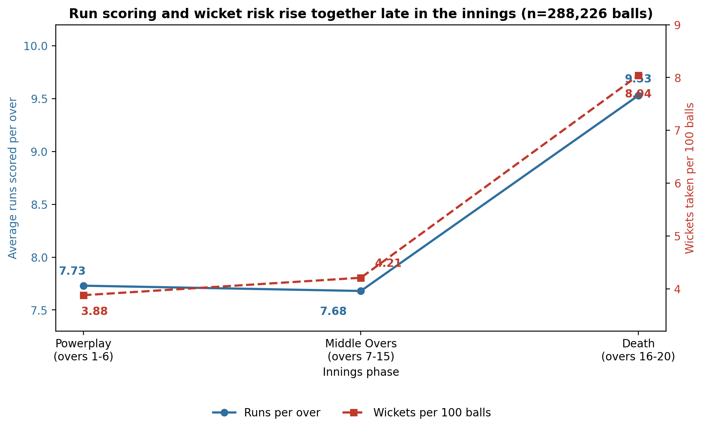
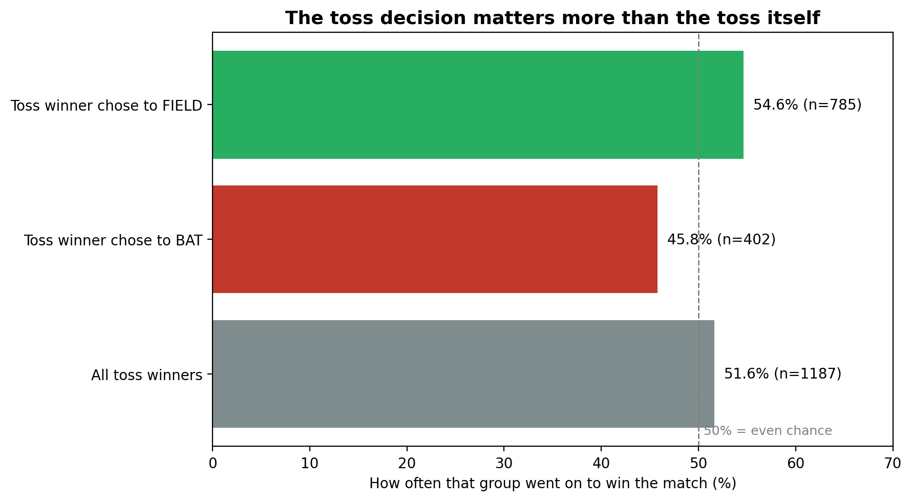
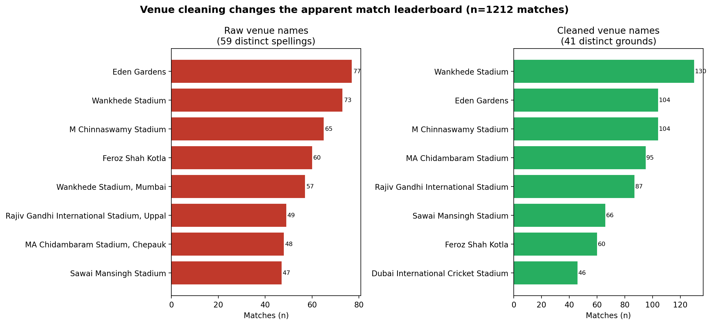
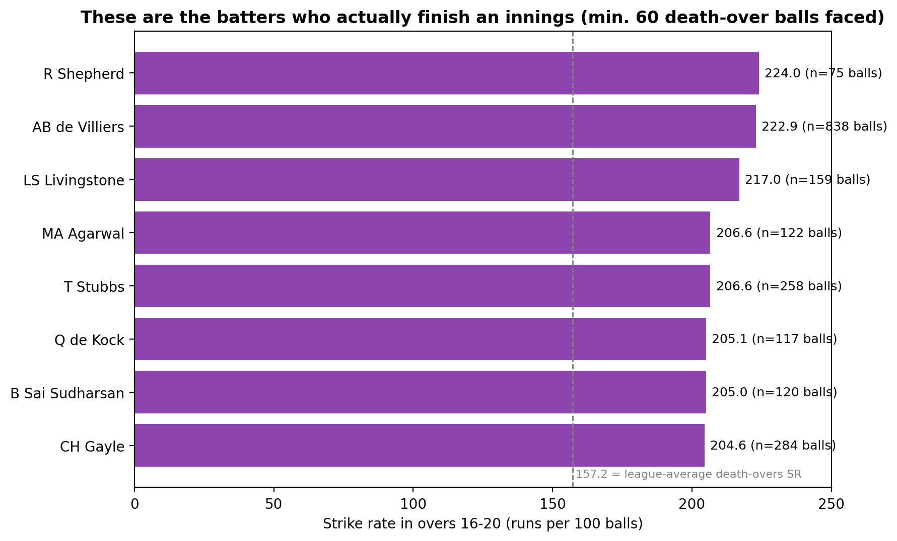

# IPL Cricket Analytics — Analysis Report

**Part 4 deliverable** — five decision-focused charts and one Analysis Report entry per scenario,
built from the real IPL ball-by-ball dataset (2008–2026, 1,212 matches, 288,226 deliveries).
Source basis: `Part 4 — Charts & the Analysis Report` student guide (Runbook pp. 118, 186–189).

**Step 4.15 update:** Of the findings I tested, these survived and these did not. The toss-decision
finding (G3) and the AB de Villiers death-overs finding (Specialism) survived statistical testing.
The venue-as-confounder concern behind I1 did **not** survive — venue showed no significant
association with chase outcome, which is a positive result for H2's validity. Full test detail,
p-values, effect sizes and verdicts are in `statistical_report.md`. This report and the statistical
report agree.

## Three findings I am least confident about (tested in Step 4.15)

1. **G3 — Toss split. ✅ Tested, survived (weak effect).** The gap between "chose to bat" (45.8%)
   and "chose to field" (54.6%) is statistically significant (chi-square, p = 0.0046) but the effect
   is very small (φ = 0.082). See `statistical_report.md`, Test 1.
2. **I1 — Venue before/after cleaning. ⚠️ Reframed and tested; did not survive as a confounder.**
   The manual-merge concern about venue names (e.g. Punjab Cricket Association Stadium naming) is
   still an open data-quality question, not something a hypothesis test resolves. But the deeper
   analytical worry — that pooling venues together might be inflating the H2 chase-win-rate trend —
   was tested directly: venue showed no significant association with chase outcome (chi-square,
   p = 0.7955, Cramér's V = 0.096). See `statistical_report.md`, Test 2.
3. **Specialism — Death-overs strike-rate leaders. ✅ Tested, survived (moderate effect).**
   AB de Villiers' death-overs scoring rate (838 balls) is significantly and meaningfully higher
   than the rest of the qualifying pool (Mann–Whitney U, p = 6.69 × 10⁻¹⁹, rank-biserial r ≈ 0.17).
   This test only covered AB de Villiers specifically — the other smaller-sample names on that list
   (R Shepherd, LS Livingstone, etc.) were not individually retested and their rankings should still
   be treated with caution. See `statistical_report.md`, Test 3.

---

## Scenario H2

**Question:** Does chase success change by target band?

**Number:** 81.0% chase win rate in the lowest target band (<140), falling to 24.2% in the 200+ band.

**Population:** 1,187 decisive matches (ties and no-results excluded); target = first-innings total + 1.
Band sizes: <140 n=210, 140–159 n=234, 160–179 n=316, 180–199 n=220, 200+ n=207.

**Decision:** A captain chasing under 140 should back the chase almost automatically; above 180, the
team should weigh the risk of a big chase more heavily and a bowling unit defending 200+ can be
confident it starts as the favourite.

**Doubt:** This mixes all 19 seasons and all grounds together — a small, high-scoring ground (T20
boundary-friendly venues) could be inflating the "easy chase" bands.

**Step 4.15 status:** Indirectly supported. Test 2 in the Statistical Report checked whether venue
is associated with chase outcome and found no significant effect (p = 0.7955) — so this pooled trend
does not appear to be a venue artifact. Season-by-season stability was not tested and remains an
open question.

---

## Scenario C1

**Question:** How do run-scoring and wicket-taking change across the three phases of an innings?

**Number:** Runs per over: Powerplay 7.73, Middle Overs 7.68, Death 9.53. Wickets per 100 balls:
Powerplay 3.88, Middle Overs 4.21, Death 8.04.

**Population:** all 288,226 legal and illegal deliveries in the dataset, split into Powerplay (overs
1–6, 90,565 balls), Middle Overs (overs 7–15, 132,173 balls) and Death (overs 16–20, 65,488 balls).

**Decision:** A bowling coach should treat the death overs as the highest-value coaching investment —
that is where both scoring and wicket-taking swing hardest, so a specialist death bowler is worth more
than an equally-skilled powerplay bowler on raw phase impact.

**Decision (batting side):** A batting line-up should not assume the middle overs are "safe" simply
because scoring is flat there — the wicket rate is already ticking up before the death overs begin.

**Doubt:** Powerplay and Middle-overs run rates are close enough (7.73 vs 7.68) that the "flat middle"
story could just be noise across 19 seasons of rule changes (fielding restrictions, impact-player rule,
etc.).

**Step 4.15 status:** Not selected for testing this round (only the three least-confident findings
above were tested). Still an open doubt.

---

## Scenario G3

**Question:** Does winning the toss win the match — and does the decision matter more than winning
the toss itself?

**Number:** All toss winners: 51.6% win rate (n=1,187) — close to a coin flip. Split by decision:
toss winners who chose to **bat** won only 45.8% of the time (n=402); toss winners who chose to
**field** won 54.6% of the time (n=785).

**Population:** all 1,187 decisive matches (ties/no-results excluded), grouped by the toss winner's
decision.

**Decision:** A captain winning the toss should lean toward fielding first — the association is
statistically real, though modest in size (see status below), so this should inform rather than
dominate the decision.

**Doubt:** Toss decisions are not random — captains already choose to field more often at grounds/times
where chasing is known to be easier (dew, day-night matches), so some of this gap could be captains
correctly reading conditions rather than fielding first *causing* the extra win rate.

**Step 4.15 status:** ✅ **Tested and survived.** Chi-square test of independence: p = 0.0046
(significant), φ = 0.082 (small effect), n = 1,187. Verdict: the association is real but small — see
`statistical_report.md`, Test 1. The day/day-night confound raised in the original doubt was not
separately tested and remains open.

---

## Scenario I1

**Question:** Does the raw venue column undercount or fragment the true number of grounds?

**Number:** 59 distinct raw venue spellings clean down to **41 distinct venues** — a drop of 18 (31%).

**Population:** all 1,212 matches in the dataset. Cleaning rule: drop everything after the first comma
(city/suburb tag such as ", Chennai"), replace "." with a space (fixes "M.Chinnaswamy" vs
"M Chinnaswamy"), collapse repeated whitespace. The resulting count (41) matches the figure documented
in the dataset's own README for this project version, which validates the rule.

**Decision:** Any "matches per venue," "home advantage," or "average score by ground" analysis must
run on `venue_clean`, not the raw `venue` column — using the raw column silently understates every
high-traffic ground (e.g. Eden Gardens' 104 matches were split 77/27 across two spellings).

**Doubt:** The rule is string-based, not a verified list of physical grounds — a few venues that
changed their **official** name over time (e.g. Punjab Cricket Association Stadium → ...IS Bindra
Stadium) were not merged, since they don't share a comma-prefix.

**Step 4.15 status:** ⚠️ **Reframed and tested; the confounding worry did not survive.** The cleaning
correctness question (are there really only 41 physical grounds) is a data-quality check, not
something a p-value settles, and remains open pending a manual name audit. But the analytical
question this doubt was really protecting — "is pooling venues together masking real per-venue
differences?" — was tested directly in Test 2 (chi-square, venue × chase outcome, p = 0.7955,
Cramér's V = 0.096) and found **no significant association**. That's a genuine non-survival: the
data does not support venue being a meaningful driver of chase outcome, at least among the 13
venues with enough matches to test.

---

## Specialism — Batting

**Question:** Which batters actually finish an innings, once a minimum sample size is enforced?

**Number:** Top strike rate in the death overs (16–20) among batters with ≥60 balls faced there:
R Shepherd 224.0 (n=75 balls), AB de Villiers 222.9 (n=838 balls), LS Livingstone 217.0 (n=159 balls).
League-average death-overs strike rate across all qualifying batters: 157.2.

**Population:** every legal ball (wides excluded) bowled in overs 16–20 across the dataset, restricted
to batters with at least 60 such balls faced (226 batters qualify in total).

**Decision:** When picking who bats at 6/7 to close an innings, a team should shortlist from this list
rather than relying on overall career strike rate — a player who scores fast throughout the innings is
not automatically the best death-overs finisher, and vice versa.

**Doubt:** AB de Villiers is the only name here with a genuinely large sample (838 balls); most of the
others qualify with just over the 60-ball minimum, so their rankings could shuffle a lot with one or two
more (or fewer) big innings.

**Step 4.15 status:** ✅ **Tested and survived — for AB de Villiers specifically.** Mann–Whitney U
test comparing his per-ball runs against the rest of the qualifying pool: p = 6.69 × 10⁻¹⁹,
rank-biserial r ≈ 0.17 (small-to-moderate effect), n₁ = 838 vs n₂ = 53,877. Verdict: real and
meaningful, not a sampling artifact — see `statistical_report.md`, Test 3, including an alternative
explanation (home-venue scoring conditions at M Chinnaswamy Stadium). The smaller-sample names
elsewhere on this list (R Shepherd, LS Livingstone, MA Agarwal, etc.) were **not** individually
retested and should still be read with the original doubt in mind.

---

*A written sentence is the deliverable. The SQL query is how the number was produced — see `sql/` for
the exact queries behind each scenario. Statistical test code and full verdicts are in
`statistical_report.md`.*
